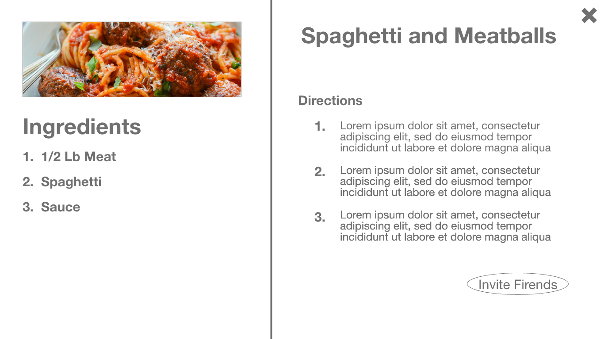

# Interaction Design
## Group
Bryant Hoang, Gabriel Rachert, Ryan Lehmer

## Summary
Our persona and scenarios gave us ideas on the type of application and the needs that such users would be able to freely use in their own unique way as the app is designed to tailor to the users.

Taking into consideration different food requirements such allergies, ingredients that recipes must include and exclude, etc.

## WireFrame
### Panel 1 - All Recipes

We created this wireframe because it represented one of the ideas that was the most wanted from our limited surveys which was to save money on food. So this wireframe shows a list of dishes when searching along with the approximate time, difficulty, and price of the dish that’s being made. 

### Panel 2 - Ingredients

People need to be able to know what is in the dish prior to making it, so this page gives the items and amount for each of the ingredients that will be needed in the dish.

### Panel 3 - Home

This page was made because some people know what they want when coming to the site while some are looking for new dishes to make. This page gives people some popular dishes front and center that they might like to try while also giving them a way to quickly get to the search function if that is what they desire. 

### Panel 4 - Side Menu

This page was made to showcase our sidebar. This allows you to just go to a page with all recipes and then filter down with options. It gives a link so that you can input the ingredients you currently have so that you can find dishes that are able to be made with what you have on hand. Our surveys showed that a majority of our repliers would cook with friends sometimes if they had the option to. We then needed a settings page so that one could input their allergies so that it would automatically filter out dishes with those ingredients and you wouldn’t have to re-input them every time you returned to the site. 

### Panel 5 - Search Bar

This wireframe shows our quick search functionality and how it would give predictive results that others have input. This was done because of our research that showed that people don’t have or want to spend a lot of time on their meals and they want to get what they are looking for quickly. 

### Panel 6 - Recipe

Most of this page wasn’t from research. The invite friends button was the only part that was from research. This is because it is rather difficult to have a food website if you don’t include the recipes.  

### Panel 7 - Freinds

This is the page that allows for the adding of friends to join in to cook with the user on the recipe as well as adding friends. This was inspired by the idea that many people want to hang out with friends while still trying to cook as seen from user data done in research.

### Panel 8 - Invite Sent

This is part of the friends research, and just shows the confirmation when you send an invite to one of your friends to join in on the cooking. 

## Supplementary Materials
[Prototype Wireframe](https://xd.adobe.com/view/52b73d44-dec3-470c-885c-c0341847227d-07e4/)
